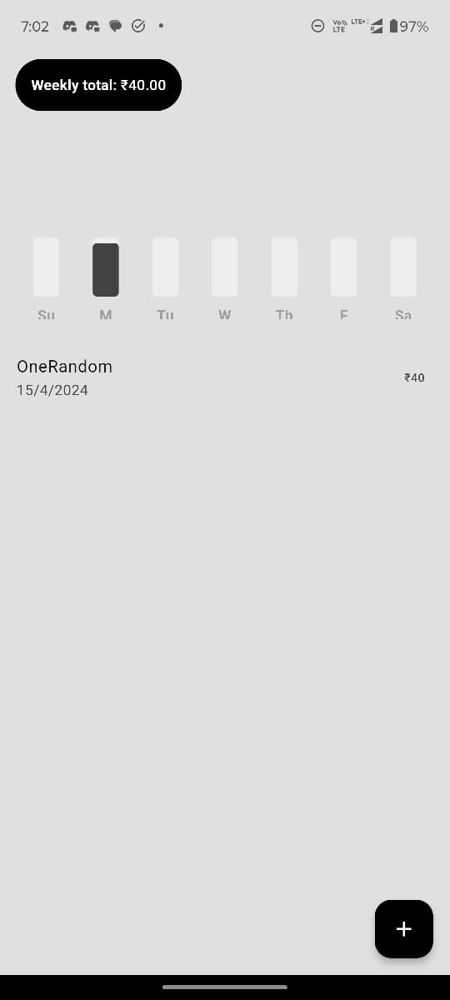
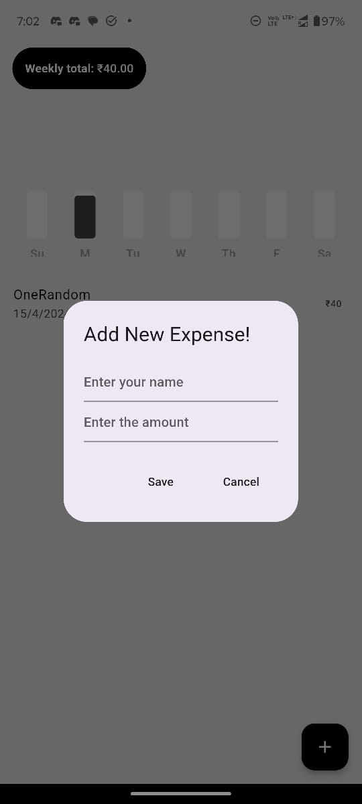

# billz
🧐 Features
-----------

Here are some of the billz's best features: 
* Just a picture of invoices is categorized and tallied in you expense reports. 
* One stop guide to all your expenses. 
* Analysis of you day-to-day expenditure

💻 Built with
-------------

Technologies used in the project: 
* Python 
* Flutter 
* Flask 
* Tesseract

⚡ Future Plans
-------------

* Deploying a LLM model to categorize the products 
* Wider range of categorization 
* Increasing the accuracy of the OCR - Application 
* Option for users to add their own categories 
* Integrating UPI apps for ease of access

🤝 Contributing
----------------

Refer to [contribution.md](https://github.com/billz-app/billz/billz/CONTRIBUTION.md) if you want to contribute to billz

🚀 Installation Guide
----------------

Follow these steps to get the app running on your local machine:

1. Clone the repository:
`git clone https://github.com/billz-app/billz`
2. Navigate to billz folder inside the project folder and get all pub dependencies:
`cd billz && flutter pub get`
3. Run the app!:
`flutter doctor run`

📸 Screenshots
----------------

<table>
  <tr>
    <td></td>
    <td></td>
  </tr>
</table>